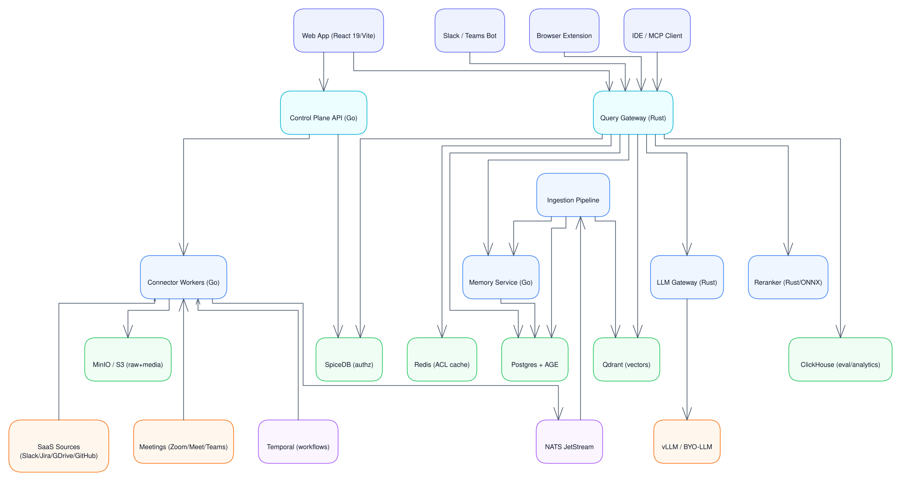
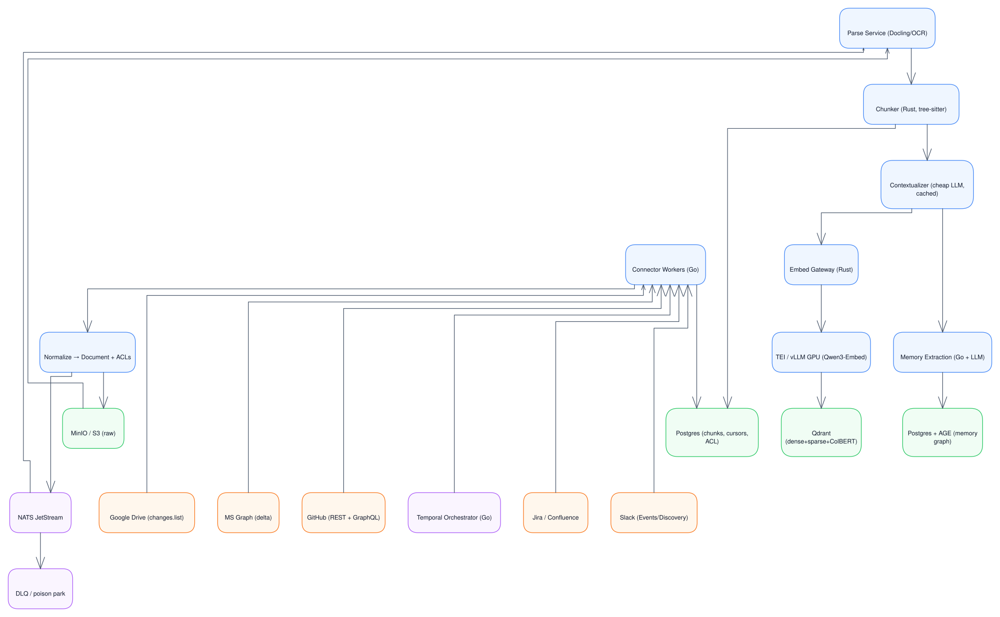
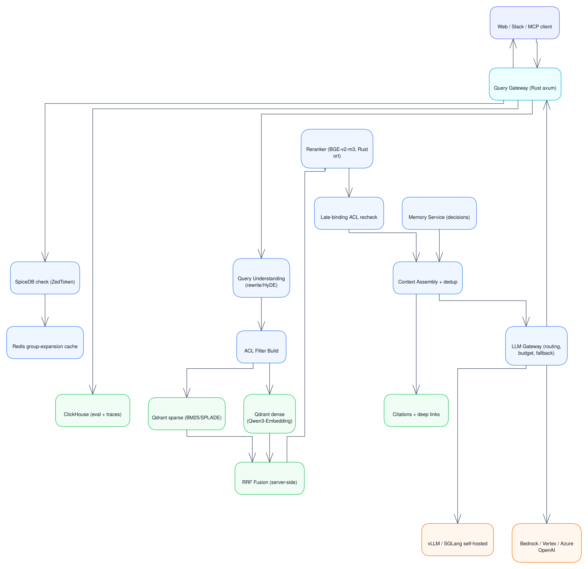
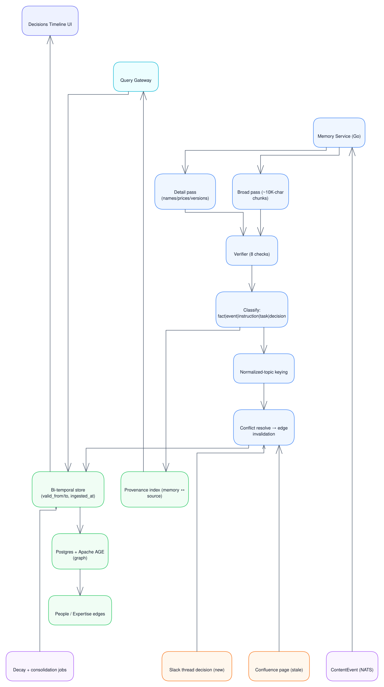
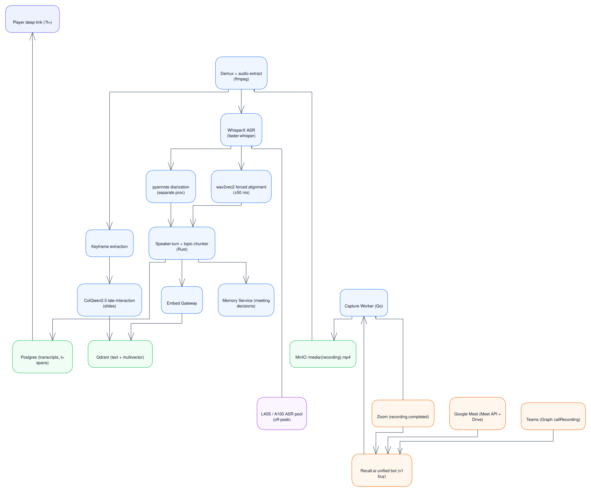
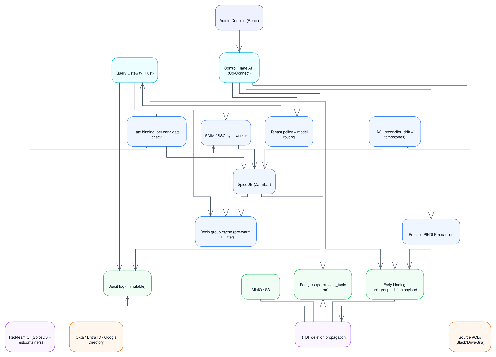

# Cortex — the company's brain

Cortex ingests enterprise content (chat, docs, code, tickets, CRM, meetings and video),
builds hybrid and late-interaction retrieval over Qdrant, maintains a temporal
memory/decisions layer, and serves grounded, cited answers through search, chat,
Slack/Teams bots, a browser extension, and MCP.

It is open-source and self-hostable end to end, with a bring-your-own LLM
(including fully air-gapped operation).

---

## Design principles

- **Permission parity.** Never return anything the user could not already open in the
  source system. Enforced twice — ACLs indexed into the vector payload (early binding)
  *and* rechecked per candidate at query time (late binding).
- **Retrieval quality is a pipeline, not a component.** Hybrid dense + sparse search,
  RRF fusion, then cross-encoder reranking is the baseline. Naive "embed → top-k →
  generate" fails at the retrieval step roughly 40% of the time in production.
- **Freshness beats completeness.** A decision in a Slack thread supersedes a stale
  Confluence page, and the system models that explicitly.
- **Everything is observable and evaluable.** OpenTelemetry traces span
  ingestion → retrieval → generation; CI gates on retrieval metrics.

### Non-goals

- Not a system of record — Cortex is read-only against sources, apart from optional
  memory write-back.
- Not a general chatbot platform — the LLM is pluggable.
- v1 targets near-real-time freshness (seconds to minutes), not sub-second event streaming.

---

## System architecture

<!-- lucid-diagram:cortex-system-architecture -->

**Figure 1 — System architecture.** Click to open full size.
<!-- /lucid-diagram:cortex-system-architecture -->

The system splits into three planes. The **control plane** (Go) owns tenants, connector
configuration, SCIM/SSO sync, policy and audit. The **ingestion plane** pulls from SaaS
sources through Temporal-orchestrated Go workers, persists raw payloads to object
storage, and emits content-addressed events onto NATS JetStream for the parse → chunk →
contextualize → embed pipeline. The **retrieval plane** is a Rust hot path: the query
gateway expands permissions, runs hybrid search against Qdrant, reranks with a
cross-encoder, assembles context, and streams tokens back over SSE with inline citations.

### Why this language split

Rust's advantage bites at the tail. Benchmarked gRPC servers show a Rust/tonic server
holding ~16 MB RSS as the most CPU-efficient implementation, while Go shows a marked p99
spike under load; one production migration reported p99 of 310 ms on Rust against
1,550 ms on Go at 25K RPS, because a GC — however good — still pauses. Go keeps its
edge for the connector fleet, where remote API latency dwarfs GC jitter and SDK maturity
and developer velocity dominate. Python is unavoidable for ML, ASR and document parsing,
and is isolated behind gRPC so it never sits on the latency-critical path.

### Service inventory

| Service | Language | Responsibility |
| --- | --- | --- |
| `query-gateway` | Rust (axum/tonic/tower) | Hot path: ACL → search → rerank → context → LLM, SSE streaming |
| `reranker` | Rust (ort/ONNX) | Cross-encoder / ColBERT reranking |
| `chunker` | Rust (tokenizers, rayon) | Structural, semantic and AST-aware chunking |
| `embed-gateway` | Rust | Batches embed requests, routes to TEI/vLLM, applies backpressure |
| `llm-gateway` | Rust | Model routing, fallbacks, budget caps, prompt cache, memory injection |
| `connector-workers` | Go (Temporal SDK) | Per-source fetch/sync, rate limits, incremental cursors |
| `ingestion-orchestrator` | Go | Temporal workflows for backfill and incremental sync |
| `parse-service` | Python (Docling/Unstructured) | PDF, table and OCR extraction |
| `asr-service` | Python (WhisperX + pyannote) | Transcription and diarization |
| `memory-service` | Go + LLM | Fact/decision extraction, dedup, conflict resolution, decay |
| `control-plane` | Go (connectrpc, sqlc) | Admin, tenant, policy, SCIM, audit |
| `authz` | SpiceDB | Zanzibar-style permission checks |
| `web` | TypeScript (React 19/Vite) | UI |

---

## Ingestion plane

<!-- lucid-diagram:cortex-ingestion-plane -->

**Figure 2 — Ingestion plane.** Click to open full size.
<!-- /lucid-diagram:cortex-ingestion-plane -->

The ingestion plane turns heterogeneous SaaS content into indexed, permission-tagged
chunks. Connector workers run as Temporal activities with bounded retries, honouring
each source's rate-limit model. Every fetched item is normalized to a canonical Document
with its ACLs and permalink, persisted raw to object storage, and announced as a
`ContentEvent` keyed by SHA-256 so re-ingestion is idempotent. Memory extraction runs
asynchronously off the same event stream.

**Stages.** Fetch (idempotent Temporal activity, incremental via webhook or cursor) →
normalize to a canonical Document capturing ACLs, permalink and author → persist raw to
object storage → emit `ContentEvent` on NATS JetStream → parse → chunk → contextualize →
embed → upsert → asynchronous memory extraction.

**Contextual retrieval.** Each chunk is prefixed with a 50–100 token LLM-generated
context before embedding. Published results put the top-20 retrieval failure rate at
5.7% → 3.7% with contextual embeddings, → 2.9% adding contextual BM25, and → 1.9% adding
reranking, at roughly $1.02 per million document tokens with prompt caching. A credible
critique shows reranking plus BM25 alone reaching 3.5% on some corpora without the
contextualization step, so this stage is **gated behind per-corpus evaluation** rather
than assumed to pay for itself.

**Backfill smoothing.** The initial sync is the spike that breaks things. Bounded
workflow concurrency, a per-source token bucket, and off-peak scheduling cap GPU spend.
Retries are explicitly bounded — an unbounded-retry connector workflow averages ~156
Temporal actions per run against ~8 on the happy path — using `MaxAttempts`, a raised
`MaximumInterval`, `NonRetryableErrorTypes` for permission and validation failures, and
workflow timers rather than process sleeps for rate-limit backoff.

---

## Retrieval and query path

<!-- lucid-diagram:cortex-retrieval-query-path -->

**Figure 3 — Retrieval query path.** Click to open full size.
<!-- /lucid-diagram:cortex-retrieval-query-path -->

A query resolves permissions from cache, optionally rewrites, builds an ACL prefilter,
runs dense and sparse search in parallel with server-side RRF fusion, reranks the top 100
down to 10 with a cross-encoder, rechecks authorization on the survivors, assembles
context, and streams the answer with citations. The path is budgeted to roughly 105 ms
p50 and 800 ms p99 before generation begins.

### Latency budget (excluding generation)

| Stage | Service | p50 | p95 | p99 |
| --- | --- | --- | --- | --- |
| Auth + group expansion (cached) | authz / Redis | 3 ms | 10 ms | 25 ms |
| Query understanding (optional) | Rust / LLM | 20 ms | 120 ms | 250 ms |
| ACL filter build | query-gateway | 2 ms | 6 ms | 12 ms |
| Hybrid search, top-100 | Qdrant | 25 ms | 70 ms | 150 ms |
| Rerank 100 → 10 | reranker | 40 ms | 120 ms | 300 ms |
| Context assembly + dedup | query-gateway | 10 ms | 30 ms | 60 ms |
| **Retrieval subtotal** | | **~105 ms** | **~400 ms** | **~800 ms** |
| LLM TTFT (self-hosted 70B FP8) | llm-gateway | 250 ms | 600 ms | 1.2 s |

Note that the late-binding permission recheck runs *after* reranking, so it validates
roughly ten candidates rather than a hundred — correctness without paying for it in the
budget above.

**Hybrid search** fuses dense (Qwen3-Embedding) and sparse (BM25/SPLADE) results with
Reciprocal Rank Fusion, worth 15–30% retrieval accuracy over pure vector search; keyword
matching is what rescues acronyms, error codes, SKUs, IDs and names such as `1099-MISC`.
Qdrant performs the fusion server-side.

**Reranking** with a cross-encoder over the top 100 is the step that fixes
lost-in-the-middle behaviour. ColBERT-style late interaction is the scale-friendly
alternative.

**Agentic vs single-shot.** Single-shot plus rerank is the default because it is fast,
cheap and good enough. Multi-step agentic retrieval is reserved for explicit deep-research
queries where the user tolerates ~15 seconds.

**Grounding.** Answers carry inline citations with deep links — message permalink, Jira
issue, video timestamp — and the system abstains when the top rerank score falls below
threshold.

---

## Memory layer

<!-- lucid-diagram:cortex-memory-temporal-graph -->

**Figure 4 — Memory and temporal graph.** Click to open full size.
<!-- /lucid-diagram:cortex-memory-temporal-graph -->

The memory layer is what separates Cortex from ordinary RAG: it knows what is *currently*
true, not merely what was written. Two extraction passes run over each episode, a verifier
screens the candidates, and the survivors classify into facts, events, instructions, tasks
and decisions. Facts, instructions and decisions are keyed by normalized topic; when a
newer memory arrives on the same topic the older edge is invalidated rather than deleted,
so history stays citable.

**Bi-temporal model.** Every memory edge tracks both valid time (when the fact was true
in the world) and ingestion time (when the system learned it). New facts supersede old
ones through edge invalidation, never deletion, so the history remains available for
citation and for a decisions timeline.

**Worked example — the Slack decision that overrides Confluence.** Both artifacts are
tagged to the same normalized topic. On ingesting the newer Slack thread, the
memory service sets `valid_to` on the Confluence-derived memory to the decision
timestamp and links `superseded_by`. A later query retrieves the current fact, and can
still show what it replaced and when.

**Provenance.** A bidirectional index maps every memory back to the source episodes it
was derived from, which is what makes memory-backed answers citable rather than merely
plausible.

**Implementation.** [`services/memory-service`](services/memory-service/) is the
Go service for this plane: a durable JetStream consumer, two-pass extraction, an
eight-check verifier, the bi-temporal store with conflict resolution and edge
invalidation, the AGE graph projection, decay and consolidation jobs, and the
read API behind the query gateway and the decisions timeline.

**Scope discipline.** The temporal graph earns its complexity for decisions and
expertise ("who knows about X"). Full GraphRAG-style entity graphs are deliberately
deferred — the LLM cost on every ingest is hard to justify — with a lighter-weight
middle path as the fallback if the graph proves its value. Postgres with Apache AGE
avoids operating a second database in v1.

---

## Video and audio pipeline

<!-- lucid-diagram:cortex-video-amp-audio-pipeline -->

**Figure 5 — Video and audio pipeline.** Click to open full size.
<!-- /lucid-diagram:cortex-video-amp-audio-pipeline -->

Meetings are first-class memory, not an afterthought. v1 buys capture through a unified
bot API rather than operating meeting bots in-house; v2 adds native per-platform paths
where data residency forbids a third party. Recordings are demuxed, transcribed with
word-level alignment, diarized in a separate process to avoid a VRAM spike, chunked by
speaker turn, and indexed with timestamp ranges so every citation deep-links back into
the player.

**Buy before build.** A unified bot API covers Zoom, Meet, Teams, Webex and Slack
Huddles from one endpoint at roughly $0.50 per recording hour, against a self-built
fleet that costs on the order of 3–5 engineers to build and operate plus perpetual
browser-automation maintenance. Native per-platform capture lands in v2 for tenants whose
data residency rules forbid a third-party bot: Zoom via the `recording.completed` webhook
with a download token, Meet via the Meet REST API with Drive export, Teams via the Graph
`callRecording` API subscribed tenant-wide.

**ASR.** WhisperX on a faster-whisper/CTranslate2 backend reaches up to ~70× real time on
a single high-end GPU, with word-level timestamps accurate to about ±50 ms via wav2vec2
forced alignment. Diarization runs in a **separate process** — co-locating it with
WhisperX produces a VRAM spike. int8 compute halves VRAM; roughly 100 hours of audio
costs about $1.28 on spot L40S capacity.

**Visual retrieval.** Keyframes and slides are indexed as images through ColQwen-style
late interaction, which sidesteps brittle OCR entirely; each page becomes ~1030 patch
tokens scored by MaxSim.

---

## Permissions and control plane

<!-- lucid-diagram:cortex-permissions-amp-control-plane -->

**Figure 6 — Permissions and control plane.** Click to open full size.
<!-- /lucid-diagram:cortex-permissions-amp-control-plane -->

Permission parity is the difference between a product and a breach: Cortex must never
return anything a user could not already open in the source system. Enforcement is
defense in depth. Group memberships are indexed into Qdrant payloads for a fast prefilter
(early binding), and the surviving candidates are rechecked against SpiceDB with a
consistency token before they reach the model (late binding). SCIM sync invalidates the
group cache on membership change, an ACL reconciler repairs drift on every sync, and a
red-team CI suite asserts that unauthorized chunks never surface.

- **SpiceDB** is chosen over OpenFGA and Permify for its consistency guarantees: ZedToken
  consistency tokens make a check at least as fresh as a given causality point. This
  matters concretely — removing a user from a sensitive group must take effect
  immediately, which is why SCIM sync invalidates the Redis group cache directly rather
  than waiting for a TTL.
- **Group expansion** is cached in Redis with pre-warming and TTL jitter to avoid a
  stampede against large directories.
- **ACL drift.** Deletes leave tombstones, and every sync reconciles ACLs.
  Shared-to-everyone edge cases are flagged and gated by admin policy.
- **PII/DLP.** Presidio detection and redaction at ingest, with per-source rules
  configured in the admin console.
- **Right to be forgotten.** Deletion propagates from a Postgres tombstone through Qdrant
  point deletion, object-store purge and memory invalidation — every step audit-logged.
- **Tenant isolation.** Payload partitioning is the default; dedicated collections or
  shards are the exception, reserved for compliance regimes requiring per-tenant
  encryption keys.

---

## Storage

**Postgres** holds sources, documents (with a SHA-256 content hash for idempotent
re-ingest and tombstones for deletes), chunks, memories, entities and expertise edges,
sync runs, citations, and a mirror of the permission tuples.

**Qdrant** uses a single collection per embedding model with payload-based multitenancy —
never one collection per tenant, a pattern that has repeatedly hit the 1000-collection
limit within a year and forced migration. A payload index on `tenant_id` with
`is_tenant=true`, plus indexes on `acl_group_ids[]`, `source_type`, `document_id`,
`updated_at` and `is_deleted`. Named vectors carry dense, sparse and optional ColBERT
multivectors. Tiered multitenancy lets small tenants share a fallback shard while whale
tenants are transparently promoted to dedicated shards.

**Quantization.** float32 at 1024 dimensions costs roughly 5.72 GB per million vectors
before metadata; binary quantization delivers up to 32× compression, taking a 1536-dim
vector from 6 KB to 192 bytes. Keep originals `on_disk=true`, quantized `always_ram=true`,
and rescore the top candidates. Enable BQ above roughly 100K vectors; it works best on
zero-centered models of 1024 dimensions or more.

**Object store** holds raw payloads, media, transcripts and keyframes.

---

## Key technology decisions

| Concern | Chosen | Rationale |
| --- | --- | --- |
| Hot-path language | Rust | No GC, flat p99 under streaming |
| Connector language | Go | Goroutine concurrency, mature SDKs |
| ML / ASR / parse | Python | Libraries are Python-native |
| Vector DB | Qdrant | Quantization, native hybrid + fusion, tiered multitenancy |
| Authz | SpiceDB | Most Zanzibar-faithful; ZedToken consistency |
| Event bus | NATS JetStream | Sub-3 ms, far lower ops burden than Kafka (Redpanda as fallback) |
| Durable workflows | Temporal | Durable execution, retries, replay |
| Internal API | Connect/gRPC | Typed, fast, streaming |
| Browser API | Connect-Web + protobuf-es | ~80% smaller bundle than gRPC-Web, no proxy needed |
| Embeddings | Qwen3-Embedding-8B | Apache 2.0, top MTEB multilingual, Matryoshka dims |
| Reranker | BGE-reranker-v2-m3 | Open, strong, self-hostable |
| LLM engine | vLLM (+ SGLang) | TGI entered maintenance mode Dec 2025; vLLM has the ecosystem |
| ASR | WhisperX + pyannote | ~70× real time, word timestamps, diarization |
| Visual retrieval | ColPali / ColQwen | Slides as images, no brittle OCR |
| Graph | Postgres + Apache AGE | Avoids a second database in v1 |
| Meeting capture (v1) | Unified bot API | $0.50/hr beats a 3–5 engineer build |
| License | Apache core + BSL enterprise | Adoption plus commercial protection |

---

## Observability and evaluation

OpenTelemetry traces span ingestion through retrieval to generation, with Grafana LGTM
or SigNoz for the general stack, Langfuse for LLM-specific tracing, and ClickHouse for
high-cardinality evaluation logs.

**SLOs.** Retrieval p95 under 700 ms; answer TTFT p95 under 1.5 s; sync freshness p95
under 5 minutes; citation accuracy above 90%.

**Evaluation.** A golden set of at least 100 questions before any iteration, scored on
recall@k, nDCG, MRR, faithfulness and citation accuracy. Retrieval and faithfulness are
measured **independently** — a model that faithfully echoes retrieved content still
answers wrongly when retrieval returned the wrong chunks. CI fails the build on
regression against the golden set. Before user traffic exists, the golden set is
synthesized from ingested documents and reviewed by subject-matter experts. LLM-as-judge
scoring is used with known bias caveats.

---

## Scalability limits and failure modes

Ordered by what breaks first:

1. **Slack ingestion — the top risk.** `conversations.history` and `.replies` drop to
   1 request/minute with at most 15 objects per request for non-Marketplace commercially
   distributed apps. Mitigations: ship as an internal customer-built app (which retains
   the old limits), get Marketplace approval, or use the Enterprise Grid Discovery API.
   The Events API is preferred for real-time.
2. **Embedding backfill GPU spend** spikes on initial sync — smoothed by bounded queues.
3. **Qdrant RAM** blows up if binary quantization is not enabled at scale.
4. **ACL group-expansion cache stampede** against large directories — pre-warm and jitter.
5. **Temporal action explosion** from unbounded retries.

Other connector mechanics are baked into the design: Jira/Confluence points-based rate
limits favour webhooks plus incremental JQL/CQL; Google Drive watch channels expire after
at most 7 days and need automated renewal, and `changes.list` cannot filter by folder;
Microsoft Graph delta tokens can return 410 `resyncRequired`; GitHub load must be split
across separate REST and GraphQL budgets with secondary limits respected.

---

## Deployment

Kubernetes with Helm and Kustomize overlays, Terraform modules per cloud, and an
operator for the stateful components. A single-node docker-compose evaluation mode gives
a one-command install. Air-gapped operation is supported through image mirroring, offline
model bundles and a telemetry-off license mode. Sizing tiers cover evaluation, 1k, 10k
and 50k seats.

**Zero-downtime re-embedding** of ~100M chunks: dual-write into a new collection under a
new `embedding_model_version`, backfill through the queue, run the eval set, then cut
over by alias.

---

## Roadmap

| Phase | Scope |
| --- | --- |
| **v0** (0–3 mo, 4–6 eng) | Core ingestion (Slack, GDrive, Confluence, GitHub), Qdrant hybrid search + rerank, basic web UI, SpiceDB permissions, docker-compose eval mode |
| **v1** (3–6 mo, 8–10 eng) | Jira/Teams/Notion, memory layer, Slack bot, citations and deep links, eval harness, Helm/Terraform, admin console |
| **v2** (6–12 mo) | Video and audio, ColPali visual retrieval, expert finder, browser extension, MCP, connector SDK |
| **v3** (12 mo+) | Agentic deep research, decisions timeline, 50k-seat scale, air-gapped GA, marketplace connectors |

The **connector SDK** — a language-neutral interface of Fetch, Normalize, GetACLs, Cursor
and Webhook — is the differentiator against closed platforms, letting customers and the
community write their own sources.

---

## Diagram index

All diagrams are generated as semantic graphs and exported to [`docs/`](docs/) as
self-contained SVGs — no external fonts or image references, so they render anywhere and
survive an air-gapped clone. Each is embedded above at readable width and links to the
full-size file.

| Figure | Diagram | Source | Nodes / edges |
| --- | --- | --- | --- |
| [1](#system-architecture) | System Architecture | [`cortex-system-architecture.svg`](docs/cortex-system-architecture.svg) | 22 / 26 |
| [2](#ingestion-plane) | Ingestion Plane | [`cortex-ingestion-plane.svg`](docs/cortex-ingestion-plane.svg) | 20 / 21 |
| [3](#retrieval-and-query-path) | Retrieval Query Path | [`cortex-retrieval-query-path.svg`](docs/cortex-retrieval-query-path.svg) | 18 / 20 |
| [4](#memory-layer) | Memory & Temporal Graph | [`cortex-memory-temporal-graph.svg`](docs/cortex-memory-temporal-graph.svg) | 17 / 18 |
| [5](#video-and-audio-pipeline) | Video & Audio Pipeline | [`cortex-video-amp-audio-pipeline.svg`](docs/cortex-video-amp-audio-pipeline.svg) | 19 / 21 |
| [6](#permissions-and-control-plane) | Permissions & Control Plane | [`cortex-permissions-amp-control-plane.svg`](docs/cortex-permissions-amp-control-plane.svg) | 18 / 26 |
